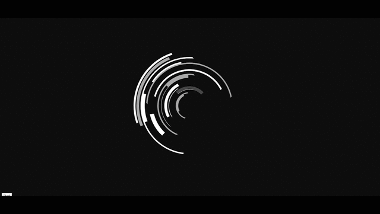

# HUD-Circles-Loading-Animation
Heads Up Display circles Loading Animation

Updated: February 10, 2021
  

 
  Basic circular loading animation, most popular for HUD (Heads Up Display).  
  Used to make these with Adobe After Effects.  

<h4>JS Code Snippet </h4>

function rotateCircles() {
    $('div[class *= "circle"]').each(function() {
        var that = this,
            direction = ["-", "+"],
            chosenDirection = direction[Math.floor(Math.random() * direction.length)],
            speed = Math.floor((Math.random() * 250) + 100),
            looper = setInterval(circleMove, 2000);

            function circleMove() {
                $(that).animate({
                    rotation: chosenDirection + '=' + speed
                }, {
                    duration: 2000,
                    easing: 'linear',
                    step: function(now) {
                        $(that).css({
                            "transform": "rotate(" + now + "deg)"
                        });
                    }
                });
            }
    circleMove();
        });
}
